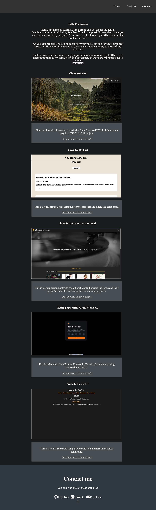

## Table of contents

- [Overview](#overview)
  - [To Do project](#to-do-project)
  - [Project setup](#project-setup)
  - [Screenshot](#screenshot)
  - [Author](#author)

## Overview

### Personal Portfolio

Welcome to my personal Portfolio. This project was built with Sass/scss and JavaScript.

The projects are dynamically generated, using Class and Objects with JavaScript.

The class is created using a constructor with these parameters: title, image, imageAlt, description and link.

The objects are in an Array of Objects so it can easily be accessed an configured.

To see this in action visit: https://rasweb.one/

## Project setup

```
npm install
```

### Compiles and hot-reloads for development

```
npm run sass
```

### Screenshot



### Author

[Github](https://github.com/Rasweb)

[Website](https://rasweb.one/)
